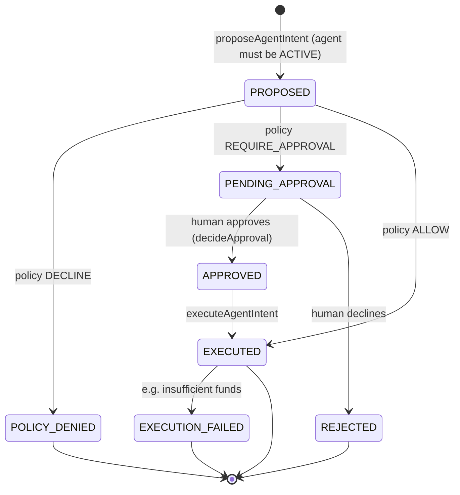

# Agentic Finance — Know Your Agent (KYA)

> Implementation of record: [`src/lib/agents.ts`](../../src/lib/agents.ts) ·
> policy DSL: [`packages/policy/src/index.ts`](../../packages/policy/src/index.ts) ·
> console: `/agents`, `/agents/[id]`, `/approvals`

Novera treats an AI agent the way a bank treats a counterparty: it gets an identity, a
scoped credential, deterministic limits, an approval trail, and a revocation switch —
**before** it is allowed to propose anything. The pipeline, from the source header:

```
AI Agent → Intent → Policy Engine → [Human Approval] → Ledger → Audit
```

The one-sentence hard rule, and it is structural rather than aspirational:

> **An LLM NEVER writes to the ledger.** It can only produce an intent proposal, which
> is validated against the agent's deterministic policy. Amounts above the approval
> threshold create an ApprovalRequest that a human decides in the console. Everything is
> auditable and revocable. — `src/lib/agents.ts`

---

## 1. Agent identity (the KYA record)

The `Agent` model is the machine-equivalent of a KYC file:

| Field | Purpose |
|---|---|
| `name`, `role` (PROCUREMENT / TREASURY / EXPENSES / BILLING / ANALYST / CUSTOM), `description` | Identity & purpose — rendered in the console and every audit line |
| `status` | `ACTIVE` / `PAUSED` / `REVOKED` — anything other than `ACTIVE` blocks new intents at the door (`proposeAgentIntent` throws `agent is paused`) |
| `scopes` | JSON array of **tool scopes**, e.g. `payments.propose`, `transfers.propose`, `suppliers.compare`, `treasury.report`, `balances.read`, `invoices.summarize` |
| `perTransactionLimitMinor`, `dailyLimitMinor`, `dailySpendMinor` | Deterministic money ceilings per intent and per day (cumulative counter) |
| `requiresApprovalAboveMinor` | The human-approval threshold |
| `allowedMerchants` | Optional merchant allowlist (JSON) |
| `credentialPrefix` + `credentialHash` | See §2 |
| `walletId` | Optional **dedicated** agent wallet (`ensureAgentWallet`) — agents never share human wallets |
| `totalActions`, `lastActiveAt` | Activity telemetry |

### Scoped credentials — hashed, shown once

Registration (`registerAgentAction` in the console) generates a secret via
`ref.agentCredential()`:

```
nv_agent_<12 random chars>
```

- Only `sha256Hex(secret)` is stored (`credentialHash`); the console shows a
  display-only `credentialPrefix` chip afterwards.
- The full secret is revealed **exactly once** in the registration success step, with a
  SHA-256 explainer — the same pattern as API keys (see
  [../security/overview.md](../security/overview.md)).
- Revocation (`revokeAgent`) is terminal, `CRITICAL`-severity audited; pause/resume is
  the reversible control.

### Wallets

`ensureAgentWallet()` provisions a `WALLET:{currency}:AGENT-{ref}` ledger account and an
`AGENT`-type wallet bound to the agent. Agent money movement executes wallet→wallet
(see §4), so an agent's blast radius is bounded by its own wallet's available balance
plus the source wallet it is permitted to draw from — not by ambient org funds.

---

## 2. The deterministic policy DSL (fail-closed)

`@novera/policy` is a *pure* rule evaluator — no I/O, no clock, no model. Facts in,
decision out:

```ts
evaluatePolicy(rules: PolicyRule[], facts: PolicyFacts): PolicyDecisionResult
// → { decision: 'ALLOW' | 'REQUIRE_APPROVAL' | 'DECLINE', reasons[], matchedRule?, evaluatedAt }
```

| Concept | Shape |
|---|---|
| **Facts** | `action`, `subjectType` (AGENT / USER / ROLE / API_KEY), `scopes`, `amountMinor`, `currency`, `merchant`, `country`, `channel`, `dailySpendMinor`, limits |
| **Condition** | `{ field, op, value }` — ops: `eq, neq, in, not_in, lt, lte, gt, gte, contains`; the special `scope` field has has/has-not semantics against the scopes array; money fields compare as `bigint` |
| **Rule** | `{ name, priority?, effect, conditions[] }` — conditions AND within a rule |
| **Evaluation** | Rules sorted by priority ascending (default 100); **first rule whose conditions all match wins** |

**Fail-closed is the point.** No matching rule → `DECLINE` with the reason:
*"No policy rule matched — fail-closed default DECLINE (least privilege)."* An LLM can
never override a policy decision, because the LLM is not in the loop at decision time.

`buildAgentGuardrailRules()` compiles an agent's KYA record into the standard guardrail
set (priorities are load-bearing — ceilings run before the allow):

| Priority | Rule | Effect |
|---|---|---|
| 10 | per-transaction ceiling — `amountMinor > perTransactionLimitMinor` | `DECLINE` |
| 11 | daily spend ceiling — `dailySpendMinor >= dailyLimitMinor` | `DECLINE` |
| 20 | human approval gate — `amountMinor > requiresApprovalAboveMinor` | `REQUIRE_APPROVAL` |
| 100 | allow scoped actions — `action in allowedActions` | `ALLOW` |

Tool scopes map to policy actions in `agents.ts`:

| Scope | Action |
|---|---|
| `payments.propose` | `payment.create` |
| `transfers.propose` | `transfer.execute` |
| `suppliers.compare` | `supplier.compare` |
| `treasury.report` | `treasury.report` |
| `balances.read` | `balances.read` |
| `invoices.summarize` | `invoices.summarize` |

---

## 3. The intent lifecycle



Statuses (stored on `AgentIntent`, mirrored in `@novera/domain`):
`PROPOSED → POLICY_DENIED | PENDING_APPROVAL → APPROVED → EXECUTED | REJECTED |
EXECUTION_FAILED`.

Step by step (`proposeAgentIntent`):

1. Load the agent **org-scoped**; require `ACTIVE`.
2. Create the intent row: `PROPOSED`, with the payload serialized as JSON — the
   proposal is treated as untrusted data and re-parsed/re-validated downstream.
   `agent.intent.proposed` audit event fires with actor `AGENT` and label
   `"{name} (agent)"`.
3. Evaluate the deterministic policy against facts derived from the intent + agent.
4. `DECLINE` → intent updated to `POLICY_DENIED` with `policyReasons` persisted
   (`policy.evaluated` audit, severity WARN). Nothing moved.
5. `REQUIRE_APPROVAL` → an `ApprovalRequest` is created (`PENDING`, requester = the
   agent, 72h expiry), intent becomes `PENDING_APPROVAL`, `approval.requested` webhook
   + audit fire.
6. `ALLOW` → `executeAgentIntent(intentId)` runs immediately.

Human decision (`decideApproval`):

- Guard: approval must still be `PENDING` ("approval already decided").
- `APPROVED` → intent `APPROVED` → `executeAgentIntent` → `approval.decided` audit +
  webhook, decidedBy/decidedByName/decisionNote recorded on the approval.
- `DECLINED` → intent `REJECTED`. Terminal; the agent must propose a fresh intent.

Honest limitations of the reference build (displayed as such in the console): the 72h
`expiresAt` on ApprovalRequest is **display-only** — there is no background sweeper
expiring requests; `decideApproval` still requires `PENDING`. The daily-spend ceiling
compares against the cumulative `dailySpendMinor` counter (which is reset by ops/seed,
not by an automatic midnight job).

---

## 4. Execution — and why an LLM can't reach it

`executeAgentIntent(intentId)` is the *only* money-movement path for agents, and its
guard is the whole design:

```ts
if (intent.status === 'EXECUTED') return intent            // idempotent replay
if (intent.status !== 'PROPOSED' && intent.status !== 'APPROVED') {
  throw new AgentError(`intent in status ${intent.status} cannot execute`)
}
```

`PROPOSED` is reachable only *from within `proposeAgentIntent`* on a policy `ALLOW`;
`APPROVED` is reachable only from a human `decideApproval`. There is no exported path
that accepts an LLM's output and executes it — the copilot endpoint
(`src/app/api/copilot/route.ts`) is a separate, read-only surface whose LLM output is
JSON-parsed defensively, validated against a fixed tool catalog, and answered with
deterministic, org-scoped ledger queries. Two-call pattern: the model routes to ONE
tool, the tool runs pure SQL, the model writes prose *from the tool result only*, with
each stored answer tagged `GROUNDED | CALCULATED | ESTIMATED | UNKNOWN`. If the model
is unreachable, an honest fallback is persisted — financial data is never fabricated.

What execution actually does:

- Money intents (`amountMinor` + `currency` present): resolve `fromWalletLabel`
  (default `Operating`) and `toWalletLabel` (default SUPPLIER wallet of the currency),
  **check available balance first** (ledger balance − active holds), then
  `postTransaction` — Dr destination wallet / Cr source wallet, `source: 'AGENT'`,
  idempotency key `agent-intent:{intentId}`, actor recorded as the agent. Insufficient
  funds throws and the intent lands in `EXECUTION_FAILED` with the reason — no partial
  movement, no silent retry.
- Read-only intents (reports, comparisons): complete with an audit event, no ledger leg.
- Post-execution: `dailySpendMinor` incremented, `totalActions` incremented,
  `agent.intent.executed` audit + webhook, `ledgerTransactionId` linked on the intent
  row so the console can deep-link the exact `ltx_…` posting.

---

## 5. Audit trail

Every state above emits a hash-chained audit event (see
[financial-kernel.md §4](./financial-kernel.md#4-immutability--reversal-only-corrections)
for chain mechanics). The agent-relevant vocabulary:

| Event | Severity | When |
|---|---|---|
| `agent.registered` | INFO | KYA moment — identity, scopes, limits recorded |
| `agent.intent.proposed` | INFO | actor = AGENT, label includes agent name |
| `policy.evaluated` | WARN | deterministic decision + reasons persisted |
| `approval.requested` | WARN | human gate armed (webhook `approval.requested`) |
| `approval.decided` | WARN | actor = the deciding human, note captured |
| `agent.intent.executed` | INFO | includes `ledgerTransactionId` |
| `agent.action.completed` | INFO | non-monetary executions |
| `agent.paused` / `agent.resumed` | WARN / INFO | console controls (status change) |
| `agent.revoked` | CRITICAL | terminal — credentials invalidated, further intents rejected |

The `/agents/[id]` page renders this trail per intent (policy decision badge, reasons
bullets, ledger reference, failure reason), and `/approvals` is the human queue with a
ticking expiry countdown, payload summary (amount, merchant, destination, tool) and a
decision-note field. The intent simulator on the same page runs the *real* pipeline
(`proposeAgentIntent` with actorLabel `"Console (human simulating agent)"`) — what you
see in the demo is the production decision path, not a mock.

---

## 6. Operator expectations

- **Before an agent can spend**: it must be registered (scopes + limits chosen
  deliberately), optionally given a wallet, and `ACTIVE`.
- **Autonomous spend** = policy `ALLOW` envelope: scoped actions, under per-txn limit,
  under daily limit, under approval threshold, sufficient wallet balance.
- **Above threshold** = a human approves within 72h or the request sits; declining is
  terminal for that intent.
- **Suspicion** = pause first (reversible), investigate the intent feed + audit chain,
  revoke if confirmed (terminal). Runbook:
  [../runbooks/security-incident.md](../runbooks/security-incident.md).

Related reading: [overview.md](./overview.md) (planes),
[financial-kernel.md](./financial-kernel.md) (what execution posts),
[../ARCHITECTURE_DECISIONS.md](../ARCHITECTURE_DECISIONS.md) ADR-0003 (fail-closed
engine) and ADR-0007 (LLM proposes / never executes).
