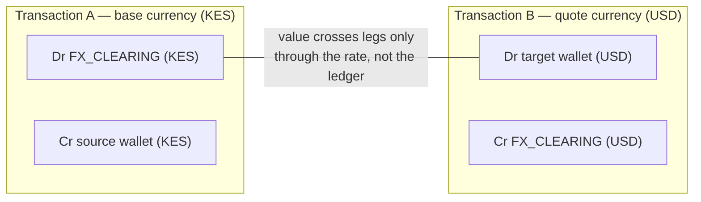

# The Financial Kernel — Double-Entry Ledger

> Implementation of record: [`src/lib/ledger.ts`](../../src/lib/ledger.ts) ·
> schema: [`prisma/schema.prisma`](../../prisma/schema.prisma) ·
> sanity check: [`scripts/verify-balances.ts`](../../scripts/verify-balances.ts)

The ledger is the component everything else defers to. It is deliberately small,
strictly typed, and boring — the money path should be the least clever code in the
system. Services (`payments`, `transfers`, `cards`, `agents`, `fx`) compose it; nothing
bypasses it, and nothing writes `LedgerEntry` rows directly.

```
   "Balances are always derived from entries — never cached state."
   — header comment, src/lib/ledger.ts (invariant #5)
```

---

## 1. The tables

Three Prisma models carry the entire accounting model:

| Model | Role | Key columns |
|---|---|---|
| `LedgerAccount` | Chart of accounts entry, per organization | `code` (unique per org), `type` (ASSET / LIABILITY / EQUITY / INCOME / EXPENSE), `normalBalance` (DEBIT / CREDIT), `currency` (nullable — wallet accounts are single-currency, clearing accounts are multi), `isSystemAccount` |
| `LedgerTransaction` | One posting event | `reference` (`ltx_<12>`, unique), `source` (TRANSFER / PAYMENT / PAYOUT / FX_CONVERSION / SPLIT_RULE / AGENT / CARD_AUTH / ADJUSTMENT / REVERSAL / FEE / OPENING), `status` (PENDING / POSTED / REVERSED), `idempotencyKey` (unique), `reversalOfId` (self-relation), `amountMinor: BigInt`, `currency`, actor trio (`actorType` / `actorId` / `actorLabel`) |
| `LedgerEntry` | One leg of a posting | `transactionId`, `accountId`, `direction` (DEBIT / CREDIT), `amountMinor: BigInt`, `currency` |

A **wallet** (`Wallet`) is a 1:1 wrapper around a `LedgerAccount` of type ASSET with
`normalBalance=DEBIT` — wallet balances shown anywhere in the product are
`walletLedgerBalance(walletId)`, which is a `groupBy` over that account's entries
(transactions in `POSTED` **or** `REVERSED` status — see §6). There is no `balance`
column anywhere in the schema.

The seeded system chart of accounts (`SYSTEM_ACCOUNTS` in `ledger.ts`, materialized per
org by `ensureChartOfAccounts`):

| Code | Type | Normal balance | Meaning |
|---|---|---|---|
| `MPESA_CLEARING` / `BANK_CLEARING` / `CARD_CLEARING` / `CRYPTO_CLEARING` / `INTERNAL_CLEARING` | ASSET | DEBIT | Rail clearing / in-transit legs |
| `FX_CLEARING` | ASSET | DEBIT | Multi-currency bridge for conversions |
| `FEE_INCOME` | INCOME | CREDIT | Platform fee revenue |
| `FEE_EXPENSE` | EXPENSE | DEBIT | Payment processing fees paid |
| `PAYOUT_EXPENSE` | EXPENSE | DEBIT | Disbursements |
| `CARD_EXPENSE` | EXPENSE | DEBIT | Card spend |
| `SALES` | INCOME | CREDIT | Revenue recognized on collections |
| `FX_GAIN` | EXPENSE | DEBIT | FX gain/loss |
| `CHARGEBACK_EXPENSE` | EXPENSE | DEBIT | Chargebacks & disputes |
| `OPENING_EQUITY` | EQUITY | CREDIT | Opening balances credit against equity |

---

## 2. The invariant

**Per currency, over all transactions on the books (status `POSTED` or `REVERSED`):
`SUM(debits) === SUM(credits)`. Always.** (Reversals stay in the proof — see §4/§6.)

Enforcement happens twice, by design:

1. **Pre-post, per transaction** — `validateEntries()` (ledger.ts) buckets the entry
   list by currency and rejects the posting unless every currency balances, every entry
   has a positive amount, and there are at least two entries:

   ```ts
   for (const [currency, { debit, credit }] of byCurrency) {
     if (debit !== credit) {
       throw new LedgerError(
         `unbalanced transaction in ${currency}: debits ${debit} ≠ credits ${credit}`
       )
     }
   }
   ```

   It also refuses entries whose account belongs to another organization, and entries in
   a currency that doesn't match a single-currency account. Unbalanced or cross-tenant
   input never reaches the database.

2. **Post-hoc, globally** — `trialBalance(organizationId)` recomputes the proof from
   stored data: for each distinct currency among entries of `POSTED`/`REVERSED`
   transactions, `groupBy` debits and credits and compare. The result also
   includes a classic account-level trial balance.
   The seeded demo data verifies balanced (e.g. KES / USD / USDC legs each
   `debits === credits`); the `/transactions` console page renders this live, and
   `scripts/verify-balances.ts` runs it headlessly.

Because every *transaction* balances per currency, the sum over any set of transactions
balances per currency — that is the whole proof, and it is why FX posts two
single-currency transactions instead of one mixed-currency transaction (see §7).

Money arithmetic is `BigInt` minor units throughout (`@novera/money`); there is no
`Number` on the money path, and JSON serialization converts with `.toString()`.
See ADR-0002 in [../ARCHITECTURE_DECISIONS.md](../ARCHITECTURE_DECISIONS.md).

---

## 3. Posting semantics — the actual Dr/Cr legs

The tables below are extracted from the code, not aspirational. "Wallet" means the
wallet's ledger account (ASSET, normal DEBIT). Convention: a debit increases an
asset/expense account, a credit increases income/equity; a credit decreases an asset.

### Collections, payouts, refunds (`src/lib/payments.ts`)

Gross/fee/net example from the source: customer pays **1000**, fee **48**, net **952**.

| Operation | `source` | Debits | Credits | Idempotency key |
|---|---|---|---|---|
| Collection (`direction=IN`, on settle) | `PAYMENT` | Wallet **net** (952), `FEE_EXPENSE` **fee** (48) | `SALES` **gross** (1000) | `settle:{paymentId}` |
| Payout (`direction=OUT`, on settle) | `PAYOUT` | `PAYOUT_EXPENSE` **gross** | Wallet **gross** | `settle:{paymentId}` |
| Refund (full or partial, of settled payment) | `REVERSAL` | `SALES` **refund amount** | Wallet **refund − feeShare**, `FEE_EXPENSE` **feeShare** | `refund:{paymentId}:{amountMinor}` |

Notes, because they bite:

- Collections recognize revenue on **gross** and book the fee as an explicit expense
  leg — the two debits sum exactly to the credit.
- **Payouts are guarded**: the available-balance check and the posting run in one
  transaction (`settlePayment`, `direction=OUT`) — an overdrawing payout throws
  `PaymentError` and nothing is posted. `createPayment` converts that into an honest
  `FAILED` payment (timeline + `payment.failed` webhook) rather than a crash.
- Fee share on a partial refund is `(feeMinor × refundAmount) / amountMinor` (exact BigInt
  division truncates, `walletLeg = amountMinor − feeShare` absorbs it) so each refund
  posting balances to the unit.
- **Refund retries are idempotent at the payment level**: `refundPayment` short-circuits
  when a `refund:{paymentId}:{amountMinor}` posting already exists — the retry returns
  current payment state without re-counting `refundedMinor`, re-emitting the webhook or
  appending timeline events.
- Refunds post **compensating entries** against the same accounts; the original settle
  transaction is untouched (immutability, §4).
- Fees are charged on collections only: `feeMinor = 0n` for `direction=OUT`.

### Splits, transfers, cards, agents

| Operation | `source` | Debits | Credits | Idempotency key |
|---|---|---|---|---|
| Split rule execution | `SPLIT_RULE` | Each **target** wallet — its exact allocated part | **Source** wallet — routed total | `split:{ruleId}:{paymentId}` |
| Internal transfer | `TRANSFER` | **Destination** wallet | **Source** wallet | *(none — see §6)* |
| Card capture | `CARD_AUTH` | `CARD_EXPENSE` | Wallet | `cardauth:{authId}` |
| Agent intent execution | `AGENT` | **Destination** wallet | **Source** wallet | `agent-intent:{intentId}` |
| Opening balance | `OPENING` | Wallet | `OPENING_EQUITY` | *(supplied by caller)* |

Notes:

- **Every wallet-debit path is guarded in-transaction**: internal transfers, card
  capture, FX outflow and payout settlement all check available (or ledger) balance
  through the *transaction client* and post only if funds suffice — see §6.
- Card authorization additionally declines when the wallet's *available* balance
  (ledger minus ACTIVE holds) cannot cover the auth — cards never reserve money that
  does not exist. Capture failure (wallet drained between auth and capture) leaves the
  authorization APPROVED, the hold ACTIVE, and a `card.capture.declined` audit event.

- **Split allocation is computed against the FULL weight set** — including the share
  that stays in the source wallet — via `Money.allocateBps` (largest-remainder, parts sum
  exactly to the whole). Only allocations routed to *other* wallets create entries; the
  share that stays simply stays. This avoids the classic bug of renormalizing percentages
  when the source wallet appears in its own allocation list (10/20/70 must stay 10/20/70,
  not 12.5/25/62.5). A `SplitRuleExecution` row records the exact breakdown.
- **Transfers check available balance inside the same Prisma transaction that posts the
  entries** (`executeTransfer`): available = ledger balance − active `Hold` rows. This is
  the double-spend defense for internal movement.
- **Card authorizations** place a `Hold` (funds *reserved*, not available, not moved);
  capture posts the expense leg and flips the hold to `CAPTURED`. The reference build is
  single-phase (approve ⇒ hold ⇒ capture), honest about it in the UI.
- **Agent execution** resolves `fromWalletLabel` (default `Operating`) / `toWalletLabel`
  (default first SUPPLIER wallet of the currency), verifies available funds, and posts
  wallet→wallet entries. Insufficient funds → intent `EXECUTION_FAILED` with the reason
  stored; nothing is posted.

### Reversal

| Operation | `source` | Debits | Credits |
|---|---|---|---|
| Reversal of transaction *T* | `REVERSAL` | Every entry of *T* with **direction swapped** | (same — mirrored 1:1) |

---

## 4. Immutability & reversal-only corrections

Posted ledger rows are **append-only historical fact**. The application never updates or
deletes `LedgerTransaction`/`LedgerEntry` content. Corrections are new transactions:

`reverseTransaction(orgId, transactionId, reason, actor)`:

1. Refuses unless the original is `status=POSTED` ("cannot reverse a transaction in
   status …").
2. Refuses if the original already has any reversal ("transaction already has a
   reversal") — **one reversal per transaction, ever**.
3. Creates a new `LedgerTransaction` with `reversalOfId` pointing at the original, a
   mirrored entry set (same accounts, same amounts, directions swapped), description
   `Reversal of {ref}: {reason}`, and `metadata = { reversalOf, reason }`.
4. Marks the original `REVERSED` (+ `reversedAt`) as a bookkeeping marker — the
   original's entries **remain in** balance aggregation. `accountBalance` /
   `trialBalance` aggregate entries whose transaction status is `POSTED` **or**
   `REVERSED` (`status ∈ {POSTED, REVERSED}` — see §6). That is deliberate and
   load-bearing: the reversal's mirrored entries cancel the original to zero only
   when **both** sides count. Filtering the original out instead would leave the
   mirror unopposed — every reversal would double-apply and corrupt every derived
   balance. The status flag tells auditors *which* pair of transactions offsets;
   it is never a balance filter.
5. Records a `WARN`-severity audit event (`ledger.transaction.reversed`).

Both sides of the correction remain queryable — an auditor can reconstruct the net
effect (zero) and the reason. This mirrors how real accounting systems treat errors:
you don't edit history, you book against it.

### The audit hash chain

Every mutation of consequence (ledger posts, reversals, policy decisions, approvals,
key lifecycle, risk reviews, recon resolutions — 800+ events in the seeded demo) flows
through `recordAudit()` in [`src/lib/audit.ts`](../../src/lib/audit.ts), which builds a
tamper-evident chain:

```
hash(n) = sha256( canonical( event n ) ‖ prevHash )
where canonical = JSON.stringify({
  o:    organizationId,
  a:    action,             // "ledger.transaction.posted", "approval.decided", ...
  rt:   resourceType, ri:   resourceId,
  d:    description,
  actor: actorType, actorId,
  sev:  severity,           // INFO | WARN | CRITICAL
  cid:  correlationId,
  md:   metadata (JSON),
  at:   createdAt ISO timestamp,
  prev: prevHash,           // hash of event n-1, "GENESIS" for the first event
})
```

Each `AuditEvent` row persists `prevHash` and `hash`. `AuditEvent` rows are append-only
in application code; retroactively editing *any* field of *any* event changes that
event's recomputed hash, which breaks the `prevHash` link of the *next* event — the
tamper cascades to the end of the chain.

**Verification** — `verifyAuditChain(limit = 2000)` walks events in `createdAt` order,
recomputes each hash from the stored fields plus the running previous hash, and compares
both `hash` and `prevHash`. It returns `{ totalEvents, verified, valid, firstBrokenAt? }`.
The `/audit` console page runs this on load and displays chain validity (e.g.
*818/818 valid*); the runbooks use it as the post-incident forensic gate
([../runbooks/security-incident.md](../runbooks/security-incident.md)).

Honest limitations of the reference-build chain: the sequence is ordered by `createdAt`
(with millisecond resolution) rather than a monotonic sequence number, and the chain is
global across organizations (events from all orgs interleave, which is fine for
tamper-evidence, less useful for per-org proofs). A production target adds a per-org
sequence plus anchored checkpoints (see ADR-0006).

---

## 5. Idempotency keys

Any operation that moves money accepts an idempotency key, and replaying the same key
returns the original result with **zero new side effects**:

| Surface | Key channel | Storage | Replay behavior |
|---|---|---|---|
| API `POST /api/v1/payments` | `idempotencyKey` body field or `Idempotency-Key` header | `Payment.idempotencyKey` (unique) | Original payment returned, HTTP 200 (not 201) |
| Payment settle | internal `settle:{paymentId}` | `LedgerTransaction.idempotencyKey` (unique) | `postTransaction` returns the existing posting |
| Refund | internal `refund:{paymentId}:{amountMinor}` | same | same |
| Split execution | internal `split:{ruleId}:{paymentId}` | same | same |
| Card capture | internal `cardauth:{authId}` | same | same |
| Agent intent execution | internal `agent-intent:{intentId}` | same | same |
| FX legs | internal `fx-a:{quoteId}` / `fx-b:{quoteId}` | same | both legs replay independently |
| Dashboard transfer | client-generated UUID per form submission, carried through `TransferInput.idempotencyKey` | same | original posting returned; no second risk evaluation, audit or webhook |
| Internal transfer (`executeTransfer`) | optional `idempotencyKey` on `TransferInput` | same | same — resolved before the risk gate and again inside the posting transaction, ahead of the balance guard |

Mechanics: `postTransaction` first does `findUnique({ where: { idempotencyKey } })`
inside the write transaction and short-circuits on a hit. The `@unique` constraint on
`LedgerTransaction.idempotencyKey` is the hard backstop for concurrent duplicates.

Cross-tenant note: `Payment.idempotencyKey` is globally unique in the SQLite build, so a
key chosen by org B that collides with org A's is refused at the API layer
(`PAYMENT_ERROR: This idempotencyKey is already in use by another resource`) rather than
leaking another org's record — see [../security/overview.md](../security/overview.md).

Transfers (`TRANSFER`) accept an optional `idempotencyKey` on `TransferInput` (the ledger kernel
invariant #4 finally applies end-to-end). `executeTransfer` resolves the key **before** the risk
gate, the wallet checks and the in-transaction available-balance guard — the original posting
already moved the money, so a replaying guard would spuriously fail — and returns the original
posting with zero new side effects. The key is resolved a second time *inside* the posting
transaction (before the balance guard) to serialize the same-key concurrency race: a concurrent
duplicate replays instead of being rejected by the guard or double-emitting the audit event and
webhook. The dashboard transfer dialog generates a UUID per logical form submission and reuses
it across retries of that submission, so a lost response retried by the user replays the original
posting rather than double-moving money. A key that collides with another organization's posting
is refused (`TRANSFER_ERROR: idempotency key already in use by another resource`) — keys are
globally unique, and a cross-tenant replay is never returned. Callers that pass no key keep the
legacy behavior: guarded by the in-transaction available-balance check, and a retry posts a
second, distinct transfer. Any new money-moving endpoint must ship with an idempotency key
from day one (PR checklist item in [../../CONTRIBUTING.md](../../CONTRIBUTING.md)).

---

## 6. Balance derivation & the trial-balance proof

- `accountBalance(accountId)` — `LedgerEntry.groupBy({ by: ['direction'] })` restricted
  to `transaction.status ∈ {POSTED, REVERSED}` (a reversal's mirrored entries net the
  original to zero, so derived balances return to pre-post values); the signed balance is
  `normalBalance === 'DEBIT' ? debit − credit : credit − debit`. Positive means the
  account is on its normal side.
- `walletLedgerBalance(walletId)` — resolves the wallet's ledger account and returns its
  signed balance. Available balance (transfers, FX execution, card authorization,
  agent execution) is this minus active `Hold` amounts — reserved funds are excluded,
  *pending settlement is never available*.
- **Balance guards run inside the posting transaction.** `accountBalance`,
  `walletLedgerBalance` and `availableBalanceMinor` accept a Prisma transaction client;
  every wallet-debit path (transfer, payout settle, FX outflow, card capture) reads the
  balance through the same client that posts the entries. A concurrent drain between
  check and post is impossible within the transaction — the check is serialized with
  the posting, not adjacent to it.
- `trialBalance(organizationId)` — for each distinct currency among posted entries,
  sum debits and credits, compare; overall `balanced` requires every currency balanced
  **and** total debits = total credits.

Running the proof against the seeded ledger (headless):

```bash
bun scripts/verify-balances.ts
# → per-currency lines "KES: debits X credits X → OK", wallet balances,
#   PASS: no negative wallet balances
```

The negative-balance assertion in that script is a *wallet-only* invariant (asset
accounts shouldn't go below zero); system expense/income accounts carry the
corresponding signs.

---

## 7. FX: the two-leg clearing pattern

Currencies never mix inside a transaction — the invariant is *per currency*. A
conversion KES → USD therefore posts **two balanced single-currency transactions**
bridged through `FX_CLEARING` (`src/lib/fx.ts`, `executeConversion`):



| Leg | `source` | Debit | Credit | Idempotency key |
|---|---|---|---|---|
| A (base outflow) | `FX_CONVERSION` | `FX_CLEARING` | source wallet | `fx-a:{quoteId}` |
| B (quote inflow) | `FX_CONVERSION` | target wallet | `FX_CLEARING` | `fx-b:{quoteId}` |

Rates are **scaled integers** (`rateScaled = rate × 10^8`, `rateScale=8`), never floats.
Quotes are created (`createFxQuote`, indicative mid-rate minus an 80 bps spread, 60s
expiry) and executed at the *locked* quoted rate. **A quote is a contract:** the quoted
source amount is persisted on the `FxQuote` row and `executeConversion` refuses any
execution whose amount differs — a locked rate is not a licence to settle an arbitrary
size. Execution is atomic: the status claim (`QUOTED → EXECUTED`), the available-balance
guard on the source wallet and both posting legs run in one transaction; any failure
rolls back to a still-`QUOTED` quote with nothing posted. `convertMinor` is scale-aware across
differing minor-unit exponents (KES=2, USDC=6 …) with exact BigInt math and half-up
rounding. **The `FX_CLEARING` account does not net to zero — it holds a real FX
position per currency.** Leg A debits KES into the account while leg B credits USD
out of it; debits and credits in *different* currencies never cancel within a single
account, so after a KES→USD conversion `FX_CLEARING` carries a KES debit balance and
a USD credit balance (long base / short quote). What does hold is the **global
per-currency proof**: `trialBalance` sums *all* accounts per currency, and across
all accounts each currency's total debits equal its total credits (§6). The
position is intentional — the production intent is periodic FX position
revaluation booked through the `FX_GAIN` account (mark-to-market gains/losses on
the accumulated per-currency position). The reference build posts both legs
exact at the quoted rate and never books to `FX_GAIN` — no revaluation is
performed; the accumulated position simply rides on the books at historical
rates, and the /transactions trial-balance card keeps proving the *global*
per-currency identity.

Why two transactions and not one with four entries: a single transaction mixing KES and
USD entries cannot satisfy the per-currency invariant unless the amounts happen to be
numerically equal — the invariant would be meaningless. Splitting per currency keeps
every proof local and the clearing account explains the bridge. See ADR-0005.

---

## 8. Invariants checklist (for PR review)

Before merging anything that touches the money path, verify:

1. Every new posting passes `validateEntries` semantics: ≥ 2 entries, positive amounts,
   per-currency balance.
2. Every money-changing operation carries an idempotency key (unique constraint intact).
3. Corrections are reversal-only — no `update`/`delete` on posted transactions/entries.
4. Balances remain derived (no cached balance column introduced anywhere).
5. `bun scripts/verify-balances.ts` is green; `/transactions` trial balance card is
   green; `/audit` chain is valid.
6. Money is `Money`/`BigInt` end-to-end; `.toString()` only at serialization
   boundaries; no `Number`/`parseFloat` arithmetic.

The PR checklist in [../../CONTRIBUTING.md](../../CONTRIBUTING.md) mirrors this. When a
discrepancy is suspected in a running environment, follow
[../runbooks/ledger-discrepancy.md](../runbooks/ledger-discrepancy.md).
