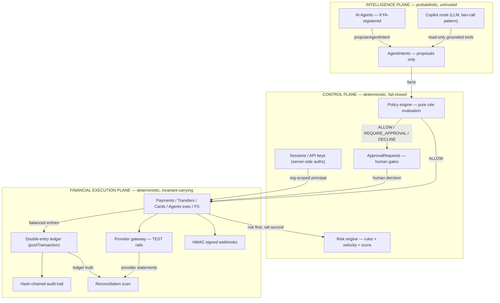
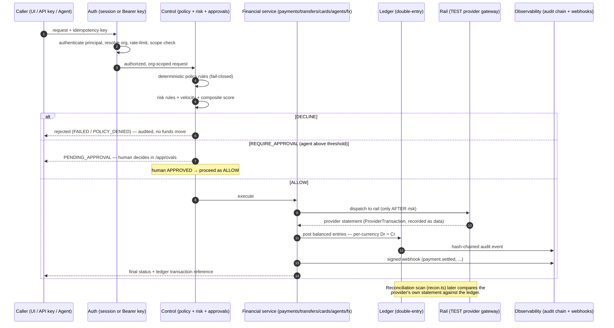

# Architecture Overview

> **Novera is programmable financial infrastructure.**
> Tagline, and the actual control-flow contract: **"AI proposes. Policy authorizes. The ledger records."**

This document describes the real system in this repository — file paths, module names and
invariants refer to the code as shipped. Where something is reference-build-only (sandbox
rails, in-memory rate limiting) it is called out explicitly rather than papered over.

Companion documents:

| Topic | Document |
|---|---|
| Double-entry ledger design | [financial-kernel.md](./financial-kernel.md) |
| Agents, KYA, policy, approvals | [agentic-finance.md](./agentic-finance.md) |
| Provider rails & reconciliation | [provider-rails.md](./provider-rails.md) |
| Security model & red-teaming | [../security/overview.md](../security/overview.md) |
| Decision log (ADRs) | [../ARCHITECTURE_DECISIONS.md](../ARCHITECTURE_DECISIONS.md) |
| API surface notes | [../api/openapi-notes.md](../api/openapi-notes.md) |

---

## 1. The three planes

Novera separates money movement into three planes with a strict, one-way data flow:



### Why the separation exists

**Probabilistic components cannot hold financial invariants.** An LLM produces plausible
output — plausible is the opposite of what a ledger needs. The ledger's core promise is
that for every currency, at every point in time, `SUM(debits) === SUM(credits)` over all
posted entries. That property can only be guaranteed if every mutation passes through a
component that is:

1. **Deterministic** — same input, same decision, every time. No temperature, no
   sampling, no model drift. `evaluatePolicy()` in
   [`packages/policy/src/index.ts`](../../packages/policy/src/index.ts) is a pure
   function over an ordered rule set.
2. **Fail-closed** — absence of an allow is a deny. When no rule matches, the engine
   returns `DECLINE` with the reason *"No policy rule matched — fail-closed default
   DECLINE (least privilege)."*
3. **Verifiable after the fact** — every decision is persisted (`RiskEvaluation`,
   `AgentIntent.policyDecision/policyReasons`, `AuditEvent`) so a human or auditor can
   reconstruct exactly why money moved.

So the planes divide responsibility by *trust model*, not by convenience:

| Plane | Trust model | May do | May never do |
|---|---|---|---|
| Intelligence | Untrusted input generator | Produce intents, prose, analysis | Touch the ledger, DB writes, credential use |
| Control | Trusted decision maker | Allow / reject / escalate | Originate financial intent |
| Financial Execution | Invariant carrier | Post balanced entries, dispatch rails, audit | Accept unvalidated mutations |

The corollary, enforced structurally (see [agentic-finance.md](./agentic-finance.md)):
**the execution entry point `executeAgentIntent()` is only reachable from a policy `ALLOW`
or a human approval — there is no code path from an LLM response to `postTransaction()`.**

---

## 2. Repository map

```
novera/
├── packages/                    # Domain packages (pure, no Next.js)
│   ├── money/                   #   Money: BigInt minor units, largest-remainder allocation
│   ├── domain/                  #   Status unions, state-machine guards, *_STATUS_META
│   ├── policy/                  #   Deterministic fail-closed policy evaluator + guardrails
│   └── events/                  #   Domain event catalog (webhooks/audit vocabulary)
├── prisma/
│   ├── schema.prisma            # 30-model financial kernel schema (SQLite build)
│   └── seed.ts                  # Demo data through the real kernel
├── src/
│   ├── lib/                     # KERNEL SERVICES — the execution plane core
│   │   ├── ledger.ts            #   postTransaction / reverseTransaction / trialBalance
│   │   ├── payments.ts          #   Payment state machine: risk → rail → ledger → webhooks
│   │   ├── transfers.ts         #   Wallet-to-wallet w/ available-balance holds
│   │   ├── cards.ts             #   Deterministic controls + holds + capture
│   │   ├── agents.ts            #   proposeAgentIntent / decideApproval / executeAgentIntent
│   │   ├── fx.ts                #   Two-leg FX clearing at locked scaled rates
│   │   ├── risk.ts              #   Rules + velocity + composite score
│   │   ├── gateway.ts           #   TEST rail dispatch + explainable routing
│   │   ├── recon.ts             #   Scan + case resolution
│   │   ├── audit.ts             #   sha256 hash chain
│   │   ├── auth.ts / session.ts #   scrypt passwords, opaque session tokens
│   │   ├── api-auth.ts          #   Hashed API keys, rate limits, request logs
│   │   └── webhooks.ts          #   HMAC-SHA256 signing + retries
│   ├── app/
│   │   ├── (app)/               # Operator console (server components + server actions)
│   │   ├── api/v1/              # Public REST surface (Bearer keys, scoped)
│   │   ├── api/copilot/         # Intelligence-plane endpoint (LLM, server-side only)
│   │   └── pay/[token]/         # Public hosted checkout
│   └── components/              # shadcn/ui + shared Novera primitives (MoneyText, ...)
└── scripts/verify-balances.ts   # Trial-balance + negative-balance sanity check
```

---

## 3. The canonical request lifecycle

Every money-moving request — whether it starts as an HTTP call to
`POST /api/v1/payments`, a server action in the console, a public checkout submission, or
an agent intent — travels the same pipeline:

**intent → auth → policy → risk → service → ledger → rail → recon**



Walkthrough of the guarantees at each hop (concrete code references):

1. **Intent** — the caller states *what should happen*: `POST /api/v1/payments` body,
   `createPaymentAction()` in the console, `payLinkAction()` on hosted checkout, or
   `proposeAgentIntent()` from the intelligence plane. Intent payloads are untrusted
   data; every field is re-validated server-side (`Money.fromMajor` parsing — never
   `parseFloat`).
2. **Auth** — the principal is resolved server-side only. Console routes call
   `requireSession()` (opaque session cookie); API routes go through
   `withApiKey()` (`src/app/api/v1/_lib/auth.ts`): Bearer extraction → key hash lookup →
   rate limit → ANY-of scope check → org-scoped handler. See
   [../security/overview.md](../security/overview.md).
3. **Policy** — deterministic rules evaluated before anything moves. For agents this is
   `evaluatePolicy()` (fail-closed, see [agentic-finance.md](./agentic-finance.md));
   card authorizations run hard controls (limits, MCC/merchant/country allowlists,
   channel toggles) in `authorizeCard()`; `SPLIT_RULE` activations require an operator
   decision recorded on the rule.
4. **Risk** — `evaluateRisk()` runs *before* any rail submission (directive: risk is a
   gate, not a post-mortem). `DECLINE` → payment fails with reasons; `REVIEW` → payment
   parks in `PENDING` for the manual queue at `/risk`. Velocity checks count same
   customer activity over 24h.
5. **Service** — the state machine (payments: `CREATED → AUTHORIZED → PROCESSING →
   (PENDING) → SETTLED | FAILED | ...`, guarded by `canTransitionPayment` from
   `@novera/domain`). Illegal transitions throw — a processing payment can never be
   rendered settled, pending funds are never available.
6. **Ledger** — on settlement the service posts balanced double entries via
   `postTransaction()` with an idempotency key. Unbalanced input is rejected before any
   write. Details in [financial-kernel.md](./financial-kernel.md).
7. **Rail** — `dispatchToRail()` submits to the (TEST) provider and *records the
   provider's own statement* as a `ProviderTransaction`. Provider status is data, never
   the source of truth for the ledger. See [provider-rails.md](./provider-rails.md).
8. **Recon** — `runReconciliationScan()` compares provider statements against the
   ledger/payments; discrepancies become operator cases (never auto-repaired). Runbook:
   [../runbooks/ledger-discrepancy.md](../runbooks/ledger-discrepancy.md).

---

## 4. Reference build vs. production target

Be honest when reading or extending this codebase:

| Concern | This repository (reference build) | Production target |
|---|---|---|
| Database | SQLite via Prisma (`db/custom.db`) | PostgreSQL 18 — same model, native enums (ADR-0001) |
| Rails | Deterministic TEST simulators only; `dispatchToRail` throws for non-`TEST` providers | Real PSP adapters behind the same `RailDispatchInput/Result` interface |
| Webhook delivery | Deterministically simulated (~90% first-attempt success), recorded as real `WebhookDelivery` rows | Async delivery workers with real HTTP + backoff |
| Rate limiting | In-memory buckets per API key | Redis-backed (the `checkRateLimit` seam is already isolated) |
| Events | In-process audit + webhook emission | NATS JetStream / Temporal orchestration (per `@novera/events` header) |
| Card auth | Single-phase (approve ⇒ hold ⇒ capture immediately) | Two-phase (auth/capture) network messages |

The honesty rules that govern both: all providers are labeled `mode=TEST` and the UI
keeps a **TEST MODE** affordance visible; a `PROCESSING` payment is never displayed as
`SETTLED`; unknown values render "—", never fabricated numbers. Marketing language
lives in the landing page; this documentation set is the engineering truth.

---

## 5. Reading order for new engineers

1. This document, then [financial-kernel.md](./financial-kernel.md) — the invariants
   come before the features.
2. [`prisma/schema.prisma`](../../prisma/schema.prisma) — the schema header comment
   encodes the same directive the code enforces.
3. [agentic-finance.md](./agentic-finance.md) and
   [provider-rails.md](./provider-rails.md) in either order.
4. [../security/overview.md](../security/overview.md) before touching anything that
   parses input or scopes a query.
5. [../ARCHITECTURE_DECISIONS.md](../ARCHITECTURE_DECISIONS.md) for *why* the odd-looking
   choices (BigInt minor units, fail-closed DSL, two-leg FX) are load-bearing.
