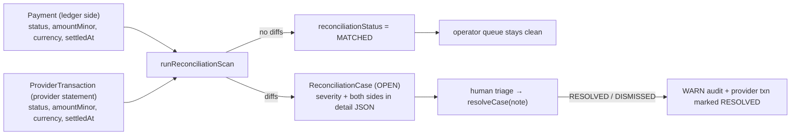

# Provider Rails — Gateway, TEST Simulators, Reconciliation

> Implementation of record: [`src/lib/gateway.ts`](../../src/lib/gateway.ts) ·
> recon: [`src/lib/recon.ts`](../../src/lib/recon.ts) ·
> schema: `RailProvider` / `ProviderTransaction` / `ReconciliationCase` in
> [`prisma/schema.prisma`](../../prisma/schema.prisma)

Novera owns intent, state, ledger, audit and reconciliation. Providers only execute
external operations. The seam between the two is deliberately thin: two interfaces and
one table.

## 1. The abstraction

```ts
// what a caller hands the gateway
interface RailDispatchInput {
  providerId: string
  paymentId: string
  amountMinor: bigint          // money crosses the seam as BigInt, never floats
  currency: string
  method: string
  customerEmail?: string | null
  customerPhone?: string | null
  forceOutcome?: 'SUCCESS' | 'FAILURE' | 'PENDING'   // sandbox affordance, clearly labeled
}

// what the gateway hands back — plus a persisted ProviderTransaction row
interface RailDispatchResult {
  ok: boolean
  externalReference: string     // the provider's own id, e.g. mpesav1_<...>
  status: 'SUBMITTED' | 'ACKNOWLEDGED' | 'SETTLED' | 'FAILED'
  latencyMs: number
  providerReference: string     // provider code
  simulated: true               // the reference build CANNOT hide that this is a simulator
}
```

The `simulated: true` literal type is not decoration — it is the honesty policy encoded
in the type system. A production adapter implements the same two interfaces against a
real PSP; the calling services never change.

`dispatchToRail` also **records the provider's own statement** as a `ProviderTransaction`
row (external reference, amount, currency, status, settledAt, and the full simulated
request/response as `rawPayload`). That row is the raw material for reconciliation —
the provider's version of events is *data we keep*, never the truth we defer to.

## 2. Deterministic TEST sandbox providers

The seeded rails (`RailProvider`, all `mode=TEST`):

| Code | Rail | Method it serves | Notes |
|---|---|---|---|
| `MPESA_V1` | MOBILE_MONEY | MPESA | M-Pesa STK-push style simulator |
| `EQUITY_EFT` | BANK | BANK | Bank EFT simulator |
| `CARD_VISA` | CARD | CARD | Card processor simulator |
| `CARD_MC` | CARD | — | secondary card rail (routing candidate) |
| `USDC_BASE` | CRYPTO | USDC | USDC transfer simulator |
| `NOVERA_INTERNAL` | INTERNAL | WALLET | internal wallet rail |

Determinism — same input, same outcome, no randomness in the money path:

- **Outcome** is derived from `sha256(providerCode:paymentId)`: the first two digest
  bytes form a bucket in `0..65535`; the dispatch succeeds when the bucket falls below
  `successRateBps × 65535 / 10000`. A given payment always gets the same result from a
  given provider — reproducible demos, reproducible tests.
- **Latency** is `latencyMsAvg` plus an md5-derived ±30ms jitter (floored at 50ms).
- `forceOutcome` overrides the hash (used by the public checkout's clearly-labeled
  "simulate failure" checkbox and by the seed to construct honest failure data).

**The honesty policy ("no fake finance")**: the gateway refuses to dispatch to any
provider whose `mode !== 'TEST'` — *"live providers are not available in this reference
environment"*. Nothing in this build can reach a live PSP, and nothing may imply real
settlement: the app shell keeps a TEST MODE badge, provider chips on payment detail
pages carry a TEST badge, and hosted checkout's failure simulation is explicitly
labeled. A payment that is `PROCESSING`/`PENDING` is never displayed as settled. This
is directive, not preference — see [overview.md §4](./overview.md#4-reference-build-vs-production-target).

## 3. Routing

Two layers, both explainable:

1. **Method → default provider** (`resolveProviderForMethod`, backed by
   `METHOD_PROVIDER_CODE`): MPESA→`MPESA_V1`, BANK→`EQUITY_EFT`, CARD→`CARD_VISA`,
   USDC→`USDC_BASE`, WALLET→`NOVERA_INTERNAL`. This is what `createPayment` engages.
2. **Rail → best provider** (`routeProvider(railType)`): among providers with
   `status=OPERATIONAL` and `mode=TEST` for that rail, score

   ```
   score = successRateBps / max(1, latencyMsAvg / 100)
   ```

   rank descending, pick the best, and return a human-readable rationale, e.g.
   *"CardVisa: success 98.9% / ~420ms — best operational score for CARD"*. Routing
   decisions are never opaque — the rationale string is rendered in the operator UI.

Fees are part of the provider record (`feeBps`, `fixedFeeMinor`) and are charged on
collections only: `feeMinor = (amountMinor × feeBps) / 10000 + fixedFeeMinor` — exact
BigInt math; payouts carry no provider fee in the reference build.

Routing fallback behavior when providers degrade (`status` flips to `DEGRADED`/`DOWN`)
is covered operationally in [../runbooks/provider-outage.md](../runbooks/provider-outage.md).

## 4. Reconciliation — the comparison model



Direction of authority: the scan **compares the provider's statement against the Novera
ledger** — never the other way around. The ledger is truth; the provider statement is
evidence. And critically, **nothing is auto-repaired**: every discrepancy becomes a case
in the operations queue (`/reconciliation`), and every resolution is an explicit operator
action carrying a note, a resolver name and a `WARN` audit event.

`runReconciliationScan(organizationId)` walks payments (excluding `CREATED`/`CANCELLED`)
and their provider transactions, comparing amount, currency, status and settlement time.
Case types as generated:

| Type | Trigger | Severity | Meaning |
|---|---|---|---|
| `MISSING_AT_PROVIDER` | Payment `SETTLED` but no provider statement exists | HIGH | Ledger claims settlement the rail never confirmed — the scariest case |
| `DUPLICATE` | More than one provider statement per payment | MEDIUM | Possible double-submit at the rail |
| `AMOUNT_MISMATCH` | Provider amount ≠ ledger amount | CRITICAL | Money moved differently than recorded |
| `CURRENCY_MISMATCH` | Provider currency ≠ ledger currency | CRITICAL | Wrong-currency settlement |
| `STATUS_MISMATCH` | Provider settled ≠ ledger settled | HIGH | State disagreement (ledger settled / rail not, or vice versa) |
| `LATE_SETTLEMENT` | Both settled, but > 24h apart | LOW | Timing drift |
| `UNKNOWN_REFERENCE` | Provider statement with no matching payment | HIGH | Orphan rail movement (first 50 per scan) |

Idempotency of the scan itself: open cases are keyed by `(paymentId, type, providerTransactionId)`
so repeat scans don't duplicate the queue. Matched comparisons flip the provider
transaction's `reconciliationStatus` to `MATCHED`; discrepancies mark it `DISCREPANCY`
with a `discrepancyType`.

`resolveCase(organizationId, caseId, 'RESOLVED' | 'DISMISSED', note, actor)` closes the
case (guard: not already closed), records the note + resolver on the case, marks the
provider transaction `RESOLVED` with the resolution JSON, and audits. Triage guidance is
in [../runbooks/ledger-discrepancy.md](../runbooks/ledger-discrepancy.md).

## 5. Production adapter contract

When a real PSP is added, it must honor, at minimum:

1. The `RailDispatchInput → RailDispatchResult` interface (drop the `simulated` literal —
   its absence is exactly the signal that the rail is live).
2. Persist a faithful `ProviderTransaction` per attempt, including a `rawPayload` that
   stands up to being shown to a customer.
3. Deterministic failures only via documented error taxonomy — no swallowed errors;
   `ok: false` must carry a reason the payment timeline can display.
4. Fee truth: `feeBps`/`fixedFeeMinor` must reflect the PSP contract, because
   `settlePayment` books the fee leg from them ([financial-kernel.md §3](./financial-kernel.md#3-posting-semantics--the-actual-drcr-legs)).
5. Rate/status semantics compatible with the `status=OPERATIONAL|DEGRADED|DOWN`
   lifecycle so `routeProvider` and the outage runbook keep working.

Related reading: [overview.md](./overview.md), [financial-kernel.md](./financial-kernel.md),
[../api/openapi-notes.md](../api/openapi-notes.md) (provider fields on payment objects),
ADR-0004 in [../ARCHITECTURE_DECISIONS.md](../ARCHITECTURE_DECISIONS.md).
